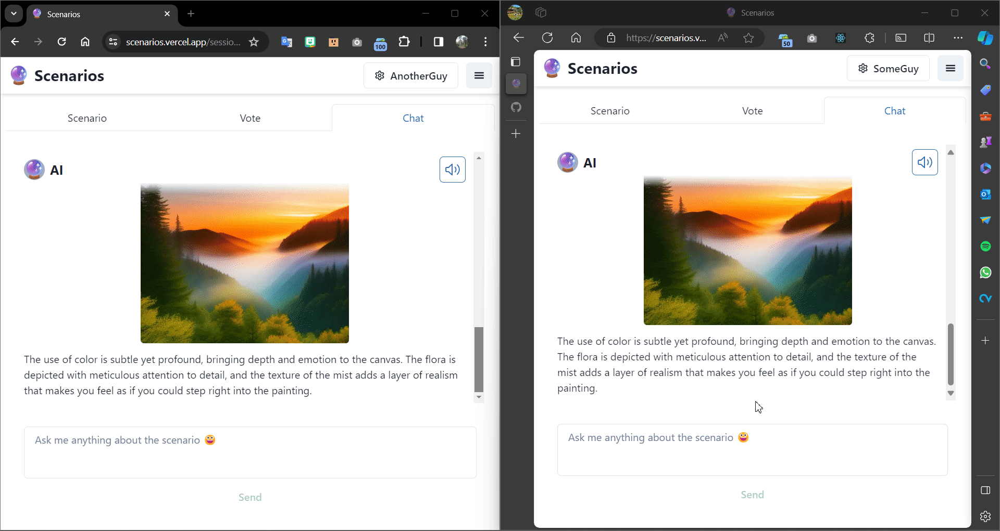
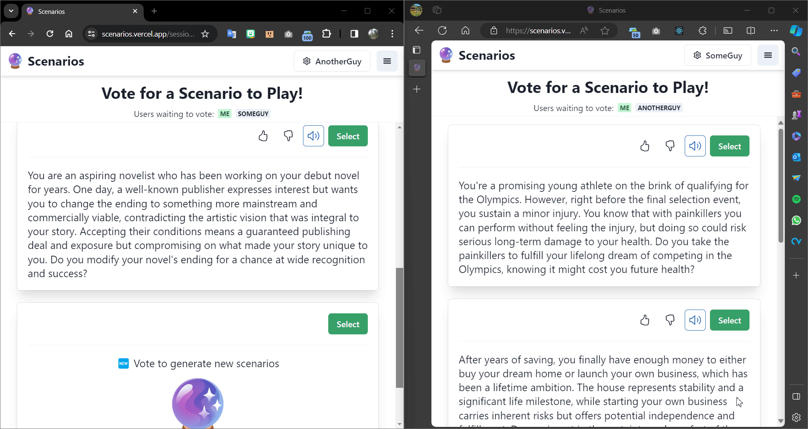

# Scenarios (In Development)

## Overview

Scenarios is a game where you try to guess what your friends would do in different AI generated situations.

The aim of the game is to learn more about how your friends think and have fun!

**Note:** This game is still in development, contributions are welcome!

## Sign up

TODO Game is still in development, sign up is not yet available, but repo can be cloned and hosted for local development/preview.

## Gameplay

### Creating and joining a session

After creating an account and logging in you can create a new session which opens a new session page. You can then invite your friends to join the game by giving them a link to the session page and they join by logging in and opening the link.


**Notes:**

- Example represents you on the left and your friend on the right, who can be on a different device somewhere else.
- When the session is created, the AI starts generating scenario options to choose from.

Example generated scenarios:

```text
You're an accomplished musician known for your dedication to classical music. However, recently, your teenage child reveals their aspiration to become a rock musician. They have shown talent but are struggling with self-confidence. They ask for your guidance and support to form their first band, which would require not only financial investment but also accepting music styles that contrast sharply with what you've dedicated your life to.

Do you encourage them by investing in their musical journey despite personal reservations about their choice of genre? Or do you persuade them to pursue something more aligned with what you consider as 'real' music?
```

```text
After years of struggling with fertility issues, you and your partner finally have the opportunity to adopt a child. However, on the same day you are matched with a potential child for adoption, you discover that you are pregnant. The adoption agency's policy requires you to proceed immediately or lose your chance at adoption forever.

Do you proceed with adopting a child who needs a home or focus on your unexpected pregnancy?
```

### Scenario selection

Each user can then vote on the scenario they want to play. If there is a tie or the majority of players vote to skip, the AI generates a new set of scenarios to choose from. When there is a scenario with a majority of votes then the game begins.

Example where users do not agree on a scenario:


Example where users agree on a scenario:


**Notes:**

- You can rate the generated scenarios to help improve the AI.
- There is the option to hear the scenario read out loud.
- A user needs to confirm their selection at the bottom of the page.
- Voting can be seen by other users in real-time.

### Discussion

Once a scenario has been chosen, each player is given a set of options to choose from for what they would do and what they think everyone else would do. Players are meant to discuss the scenario with each other to get clues as to what other players are thinking. To help players make their choices, there is a chat section where players can ask the AI for more information about the scenario, which is meant to create talking points for the group.

Layout of the discussion page:


Example of using the chat interface:


**Notes:**

- The AI generates a cover image for the scenario.
- The AI can generate images in the chat to help illustrate aspects of the scenario.
- AI knows the display names of the players that sends messages in the chat.

### Guessing and Results

Once everyone has made their choices, the game ends and the results are revealed.



Players can vote to start a new game from the results screen, which goes back to the scenario selection screen and new scenarios are generated:


## Personalisation

You can personalise aspects of the game such as:

- Display name (which is updated in real-time for all users)
- Reading voice and speed
- Theme (light/dark)



## Notes

- Game is responsive so is playable on mobile devices.

## References

- Logo from Google Fonts, see [Noto Emoji](https://github.com/googlefonts/noto-emoji), ([image](https://github.com/googlefonts/noto-emoji/blob/934a5706f1f3dd2605c4d9b5d9162fd7f89d8702/svg/emoji_u1f52e.svg?plain=1))
